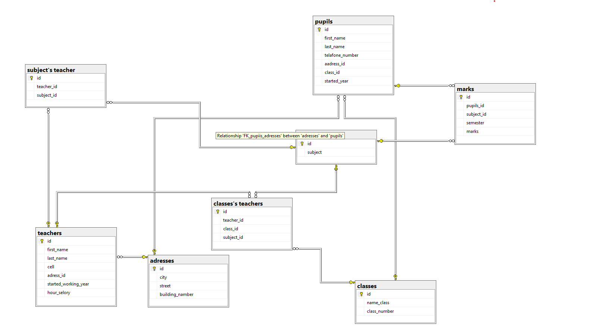

# 💉 SQL Tipat Halav Database

A SQL database system for managing Tipat Halav clinic data, vaccinations, and inventory.

---

## 📖 About The Project

This project is a SQL Server database system developed for managing a Tipat Halav clinic.

The system includes tables, stored procedures, views, and triggers for handling vaccinations, baby records, inventory management, and clinic operations.

---

## ✨ Features

- Vaccination management
- Inventory and stock tracking
- Baby medical records
- SQL stored procedures
- SQL views
- SQL triggers
- Data management and reporting

---

## 🛠 Technologies Used

- SQL Server
- T-SQL

---

## 📂 Project Structure

```text
sql-tipat-halav-database/
│
├── procedures/
│   ├── onTime_procedure.sql
│   └── updatePinkaschisunim procedure.sql
│
├── tables/
│   ├── tables.sql
│   └── insert_tables.sql
│
├── triggers/
│   └── CheckStockBeforeVaccination trigger.sql
│
├── views/
│   ├── ViewBabyVaccinationDetails.sql
│   ├── ViewBabyVaccinationDetails tikun.sql
│   └── ViewStockAndUsage.sql
│
├── database-diagram.png
└── README.md
```

---

## 🚀 How To Run

1. Open SQL Server Management Studio (SSMS)
2. Run the scripts inside the `tables` folder
3. Run procedures, views, and triggers scripts
4. Execute queries and test the database system

---

## 📸 Database Diagram



---

## 📋 Database Features

### Vaccination Management
Management of baby vaccination records and schedules.

### Inventory Tracking
Tracking vaccine stock and clinic inventory.

### SQL Procedures & Triggers
Automation of clinic database operations using procedures and triggers.

### Data Views
Database views for displaying clinic and vaccination information.

---

## 👩‍💻 Author

Created by Tamar